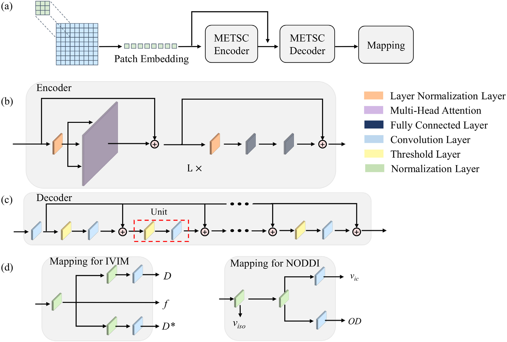

# METSC: A microstructure estimation Transformer inspired by sparse representation for diffusion MRI [[MedIA]](https://www.sciencedirect.com/science/article/pii/S136184152300049X)

## Introduction
This repository provides a demonstration of a microstructure estimation network, METSC. In this repository we offer an inference framework on NODDI model. The project was originally developed for our previous work on METSC. It is suitable for direct use or finetuning on your dataset. 

  <div style="text-align:center">
    
    <p style="text-align:center">Fig.1 The overall network structure </p>
</div>


## Requirements

Before you can use this package for image segmentation. You should install the follwing libary at least:
- PyTorch version >=1.8
- Some common python packages such as Numpy, H5py, NiBabel ...

## How to use

1. compile the requirement library.
   
2. Run our demo.
    ```
    cd METSC
    
    python test.py
    ```

## Citation

If you find it useful for your research, please consider citing the following sources:

    @article{ZHENG2023102788,
    title = {A microstructure estimation Transformer inspired by sparse representation for diffusion MRI},
    journal = {Medical Image Analysis},
    volume = {86},
    pages = {102788},
    year = {2023},
    issn = {1361-8415},
    doi = {https://doi.org/10.1016/j.media.2023.102788},
    author = {Tianshu Zheng and Guohui Yan and Haotian Li and Weihao Zheng and Wen Shi and Yi Zhang and Chuyang Ye and Dan Wu},
    keywords = {Diffusion MRI, Microstructural model, Sparse coding, Transformer},


## Acknowledge and Statement

- We thank the authors of [vit_pytorch](https://github.com/lucidrains/vit-pytorch) for his elegant and efficient code base !
- This project was designed for academic research, not for clinical or commercial use, as it's a protected patent. 
- Our demo was trained on [HCP-YA](https://www.humanconnectome.org/study/hcp-young-adult/) dataset and we used two shells ( 30 diffusion
directions per shell at b-values of 1 and 2 $ms/ \mu m^2$ )
- If you have any questions, please feel free to contact [me](zhengtianshu996@gamil.com).


